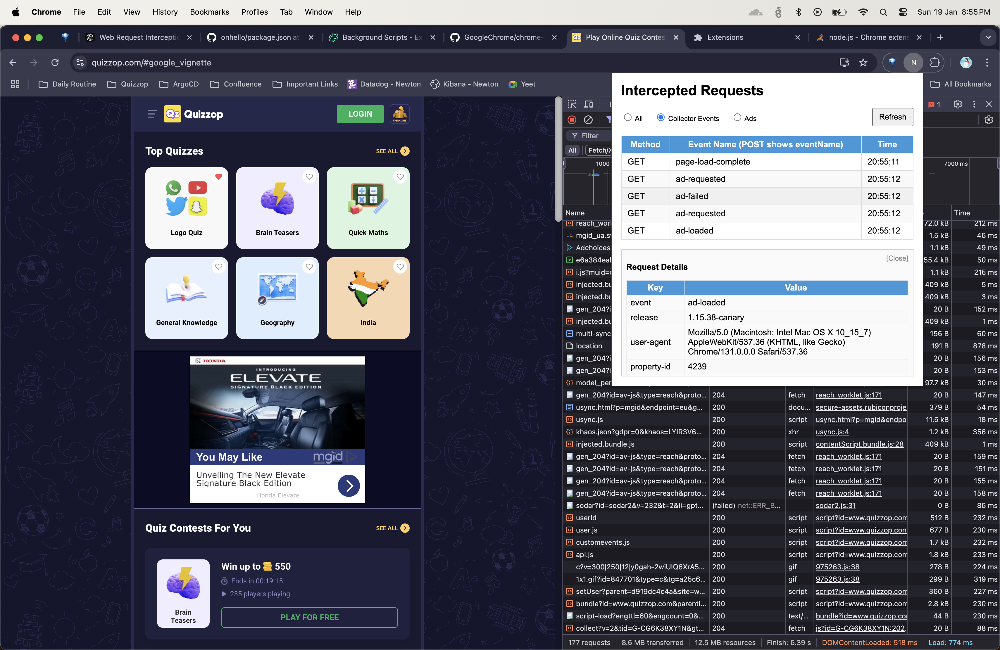
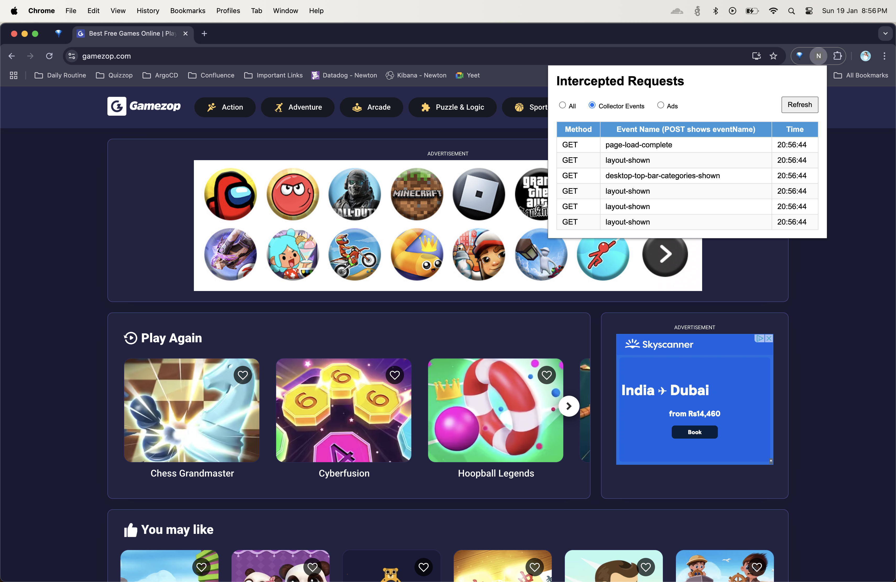
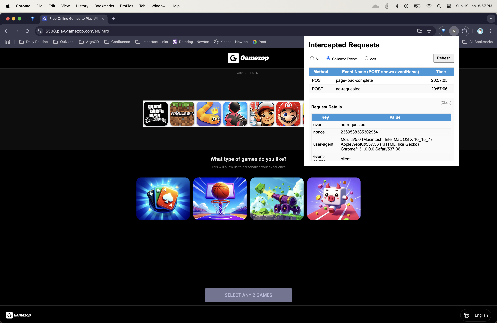

# Chrome Web Extension for Gamezop Analytics

This project is a Chrome web extension designed to analyze analytical events fired from Gamezop products. The extension utilizes an in-house SDK authored by Sahaj to track and monitor event data.

## Features

- **Event Tracking:** Monitors analytical events fired by Gamezop products.
- **Multiple Tracking Methods:** Supports both query parameter-based and POST request-based event tracking.
- **In-house SDK:** Developed internally to cater to specific tracking requirements.

## Event Tracking Methods

The extension tracks events through two primary methods:

1. **Query Parameter Tracking:**
   - Events are tracked via query parameters in the request URL.
   - Example usage:
     - **Quizzop Tracking:**
       
       - Tracks `/c/events` endpoint where event name and data are extracted from query parameters.
     
     - **Gamezop Tracking:**
       
       - Similar tracking for Gamezop products using query parameters.

2. **POST Request Tracking:**
   - Events are sent as POST requests with data included in the request body instead of query parameters.
   - Example usage:
     - **Gamezop POST Tracking:**
       
       - Utilizes the new analytics SDK for enhanced tracking capabilities.

## Screenshots

You can view the screenshots here:

- [Quizzop Example](examples/collector-quizzop.png)
- [Gamezop Example](examples/collector-gamezop.png)
- [Gamezop POST Example](examples/collector-post-gamezop.png)

## Installation

1. Clone the repository:
   ```sh
   git clone https://github.com/your-repo/chrome-extension-analytics.git
   ```
2. Load the unpacked extension in Chrome:
   - Go to `chrome://extensions/`
   - Enable Developer Mode
   - Click on "Load unpacked"
   - Select the cloned project folder

## Usage

Once installed, the extension will automatically capture and log analytical events triggered by Gamezop products. You can monitor event data through the extension interface or console logs.

## Author

This project was developed in-house and authored by **Sahaj**.

## License

This project is licensed under the MIT License.

